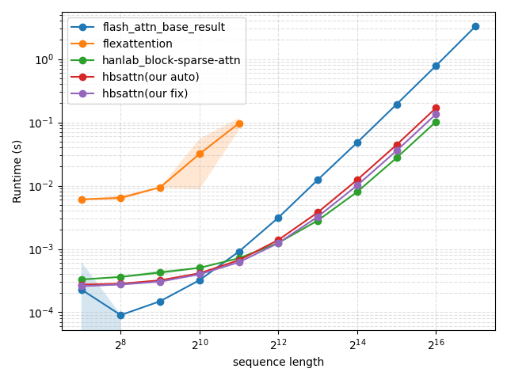

# Heterogeneous Block Sparse Attention Kernel

This repository provides a high-performance **Block Sparse Attention** kernel for PyTorch, implemented with **Triton** for GPU acceleration. The kernel is designed for efficient processing of long sequences by dividing them into blocks and utilizing a user-provided block sparse mask. 

## Features

- **Heterogeneous**: allows `q_block_size!=k_block_size` as long as they are both integer multiples of 16.
- **Variable length**: supports variable length query, key, and value inputs, and allows query and key to have different lengths, i.e., `cu_q_seqlens!=cu_k_seqlens`. 
- **Causality**: allows both `causal` and `noncausal`. 

---

## Installation

Our code mainly relies on [torch](https://pytorch.org/get-started/locally/) and [triton](https://triton-lang.org/main/index.html). For your reference, our code is developed under torch '2.6.0+cu126', and triton '3.2.0', but other versions should also work. After having torch and triton installed, please run the following command:

```bash
   git clone https://github.com/zhengqigao/hbsattention.git
   cd hbsattention
   pip install -e . # install as editable
```

---

## Basic Usage

Here's a minimal example to use the block sparse attention kernel in your PyTorch code.

```python
import torch
from hbsattn.hbsa_interface import HBSAttention

# Example of input initialization, in most cases cu_k_seqlens==cu_q_seqlens
cu_k_seqlens = torch.tensor([0, 32, 61, 100, 134, 157], dtype=torch.int32, device=device) 
cu_q_seqlens = torch.tensor([0, 32, 64, 96, 128, 160], dtype=torch.int32, device=device) 


# User should provide a block_mask
block_mask = torch.ones(B, H, Q // 64, K // 64, dtype=torch.bool, device='cuda')

q_block_size = 64
k_block_size = 64
causal = True
softmax_scale = 1.0 / (D ** 0.5)

output = HBSAttention(
    q, k, v,
    cu_q_seqlens, cu_k_seqlens,
    block_mask,
    q_block_size, k_block_size,
    causal,
    softmax_scale,
    tile_mode='auto' # or 'fix'
)

```

---

## Benchmarking Performance

### Accuracy Validation

We have provided several reference implementations in `hbsattn/reference.py`, and a pytest file `test/test_accuracy.py` to confirm the accuracy. It can be run with the command:

```bash
# tile-mode-auto supports q/k_block_size beining integer multiples of 16.
pytest -v -k "tile_mode_auto" test/test_accuracy.py

# tile-mode-fix only support q/k_block_size = power of 2. 
pytest -v -k "tile_mode_fix and not q_block_size_80" test/test_accuracy.py 
```

The above two commands will automatically run the combinations of different configurations defined in `test/test_accuracy.py` to confirm our implementation is close to the pytorch baseline.

### Runtime Validation

We compare with the following baslines on Nvidia H200 with CUDA version 12.4:

1. [Flashattention](https://www.google.com/search?client=safari&rls=en&q=Flashattention&ie=UTF-8&oe=UTF-8) (version: 2.7.4.post1): provide a reference on the runtime of a full dense self-attention at the same sequence length.
2. [Flexattention](https://pytorch.org/blog/flexattention/) (built in Pytorch '2.6.0+cu126'): with a `mask_mod` function can easily mimic a block sparse attention.
3. [block_sparse_attn from Han Lab](https://github.com/mit-han-lab/Block-Sparse-Attention): A CUDA implemenation fix `q_block_size=k_block_size=128`.

We test under the same condition as `block_sparse_attn`. We choose `q_block_size=k_block_size=128`, use `headdim=128`, and `nheads=32`, and `batch_size=8`. We vary `sequence length` from `2^7=128` to `2^16 ~= 64K`, the sparsity ratio, and casuality.




---

## Acknowledgements

Our implementation is inspired by:

1. [block_sparse_attn from Han Lab](https://github.com/mit-han-lab/Block-Sparse-Attention)
2. [Triton implementation of FlashAttention](https://github.com/Dao-AILab/flash-attention/blob/main/flash_attn/flash_attn_triton.py)

---

## TODO

The following ones are easily come to mind, but not sure how much needs are there. Please open an issue and I might work on it.

- [ ] Implement Triton backward kernel for HBSAttention (autograd support)
- [ ] Add tests for backward (gradient) correctness in `test/test_accuracy.py`
- [ ] Add support for arbitaray block size (currently only support integer multiples of 16)


