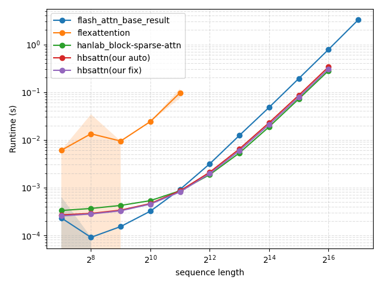
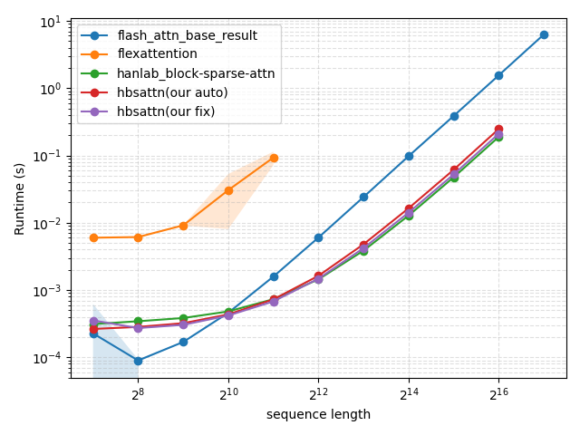
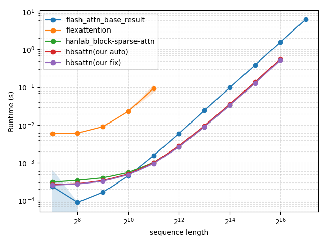

# Heterogeneous Block Sparse Attention Kernel

This repository provides a high-performance **Block Sparse Attention** kernel for PyTorch, implemented with **Triton** for GPU acceleration. The kernel is designed for efficient processing of long sequences by doing attention only on the query and key blocks allowed by the user (i.e., allowed by a given `block_mask`).

## Features

- **Heterogeneous**: allows `q_block_size != k_block_size` as long as both are integer multiples of 16.
- **Variable length**: supports variable-length query, key, and value inputs, and allows query and key to have different lengths, i.e., `cu_q_seqlens != cu_k_seqlens`. When they are not equal, we follow the convetion of alignment to right bottom. Please refer to the [Changelog 2.1 of FlashAttention](https://github.com/Dao-AILab/flash-attention/tree/main).
- **Causality**: supports both `causal` and `noncausal` modes.
- **Group query attention**: allows `nhead_q % nhead_k == 0`.
- Only support foward calculation for now.

---

## Installation

Our code primarily relies on [torch](https://pytorch.org/get-started/locally/) and [triton](https://triton-lang.org/main/index.html). For your reference, our code is developed with torch '2.6.0+cu126' and triton '3.2.0', but other versions should also work. After installing torch and triton, please run the following commands:

```bash
   git clone https://github.com/zhengqigao/hbsattn.git
   cd hbsattn
   pip install -e . # install as editable
```

---

## Basic Usage

Here's a minimal example of how to use our block sparse attention kernel in your PyTorch code.

```python

import torch
from hbsattn import HBSAttention
from hbsattn.utils import calculate_blocks

device = torch.cuda.current_device()
dtype = torch.bfloat16

# q_block_size and k_block_size need to be integer multiples of 16.
q_block_size = 32
k_block_size = 16

# nhead_q and head_k can be different to utilize group query attention (GQA).
nhead_q = 8
nhead_k = 2
headdim = 32

# Example of q/k/v input initialization; in most cases cu_k_seqlens == cu_q_seqlens
# cu_k_seqlens[1:]-cu_k_seqlens[:-1] indicate the sequence length of each sample.
cu_q_seqlens = torch.tensor([0, 32, 64, 96, 128, 160], dtype=torch.int32, device=device)
cu_k_seqlens = torch.tensor([0, 32, 61, 100, 134, 157], dtype=torch.int32, device=device) 

# This example has batch_size = 5:
# Sample 0: q_seqlen = 32 (1 block), k_seqlen=32 (2 blocks)
# Sample 1: q_seqlen = 32 (1 block), k_seqlen=29 (2 blocks, last block has 13 Keys)
# Sample 2: q_seqlen = 32 (1 block), k_seqlen=39 (3 blocks, last block has 7 Keys)
# Sample 3: q_seqlen = 32 (1 block), k_seqlen=34 (3 blocks, last block has 2 Keys)
# Sample 4: q_seqlen = 32 (1 block), k_seqlen=23 (2 blocks, last block has 7 Keys)

# Thus, total q_blocks: 5, total k_blocks: 12.
num_q_block = 5
num_k_block = 12

q_seqlen = cu_q_seqlens[-1].item()
k_seqlen = cu_k_seqlens[-1].item()

q = torch.randn(q_seqlen, nhead_q, headdim, device=device, dtype=dtype)
k = torch.randn(k_seqlen, nhead_k, headdim, device=device, dtype=dtype) 
v = torch.randn(k_seqlen, nhead_k, headdim, device=device, dtype=dtype)


causal = True # or False
softmax_scale = None # use defaulty value


# The user should provide a block_mask of shape (nheads_k, num_q_block, num_q_block). 
# Here is a random example of sparsity 30%.
block_mask = (torch.rand(nhead_k, num_q_block, num_k_block, device=device) < 0.7).to(torch.bool)

output = HBSAttention(q, k, v, cu_q_seqlens, cu_k_seqlens, block_mask, q_block_size, k_block_size, causal, softmax_scale)

print(output.shape)
```

Note that we assume the users should provide the `block_mask` correctly of the shape `(nheads_k, num_q_block, num_q_block)`. In the above example, we manually calculate the variables `num_q_block` and `num_q_block`. For general cases, we provide a function for that purpose:

```python
from hbsattn.utils import calculate_blocks
num_q_block, *_ = calculate_blocks(cu_q_seqlens, q_block_size)
num_k_block, *_ = calculate_blocks(cu_k_seqlens, k_block_size)
```

---

## Benchmarking Performance

### Accuracy Validation

We provide several reference implementations in `hbsattn/reference.py`, and a pytest file `test/test_accuracy.py` to validate accuracy. You can run it as follows:

```bash
# tile_mode='auto' supports q/k_block_size being integer multiples of 16.
# By defaulty, hbasttn calls tile_mode='auto'
pytest -v -k "tile_mode_auto" test/test_accuracy.py

# tile_mode='fix' only supports q/k_block_size as a power of 2.
pytest -v -k "tile_mode_fix and not q_block_size_80" test/test_accuracy.py
```

The above two commands will automatically run combinations of different configurations defined in `test/test_accuracy.py` to verify that our implementation matches the PyTorch baseline.

### Runtime Validation

We use the script `test/test_accuracy.py` to compare against the following baselines on an Nvidia H200 with CUDA version 12.4:

1. [Flashattention](https://www.google.com/search?client=safari&rls=en&q=Flashattention&ie=UTF-8&oe=UTF-8) (version: 2.7.4.post1): provides a runtiem reference of a full dense attention.
2. [Flexattention](https://pytorch.org/blog/flexattention/) (built in PyTorch '2.6.0+cu126'): use the `mask_mod` function to mimic block sparse attention.
3. [block_sparse_attn](https://github.com/mit-han-lab/Block-Sparse-Attention) from Han Lab: a CUDA implementation with `q_block_size = k_block_size = 128` fixed.

We mostly test under the same conditions as `block_sparse_attn`: We choose `q_block_size = k_block_size = 128`, `headdim = 128`, `nheads = 32`, and `batch_size = 8`. The `sequence length` is varied from `2^7 = 128` to `2^16 ≈ 64K`, changing the sparsity ratio, and causality.

<p align="center">
  
  
</p>
<p align="center">
  <em>Figure 1: Runtime comparison of different attention implementations in <b>causal mode</b>. Left: sparse ratio = 0.9; Right: sparse ratio = 0.7. (Batch = 8, nheads = 32, headdim = 128, block_size = 128.)</em>
</p>

<p align="center">
  
  
</p>
<p align="center">
  <em>Figure 2: Runtime comparison of different attention implementations in <b>non-causal mode</b>. Left: sparse ratio = 0.9; Right: sparse ratio = 0.7. (Batch = 8, nheads = 32, headdim = 128, block_size = 128.)</em>
</p>

**Conclusions**: It is clear from the figure that our Triton implementation `hbsattn` is very close to the CUDA implementation `block_sparse_attn`.


---

## Acknowledgements

Our implementation is inspired by the following repos. Note that previous existing block sparse attention implementation have different emphasis, so please choose according to your need.

1. [block_sparse_attn from Han Lab](https://github.com/mit-han-lab/Block-Sparse-Attention)
2. [Triton implementation of FlashAttention](https://github.com/Dao-AILab/flash-attention/blob/main/flash_attn/flash_attn_triton.py)
3. [Tilelang implementation](https://github.com/tile-ai/tilelang/tree/main/examples/blocksparse_attention) 
4. [Mobattention](https://github.com/MoonshotAI/MoBA)

I would also like to acknowledge the discussion with Tianyuan Zhang, Guanxuan Xiao, and Junxian Guo.

---

## TODO

The following are tasks that readily come to mind, though it is unclear how much demand there is for them (Backward implementation might be the most needed?) Please open an issue if you are interested, and I may work on it.

- [ ] Implement Triton backward kernel for HBSAttention (autograd support).
- [ ] Add tests for backward (gradient).
- [ ] Add support for arbitrary block size (currently only integer multiples of 16 are supported).

